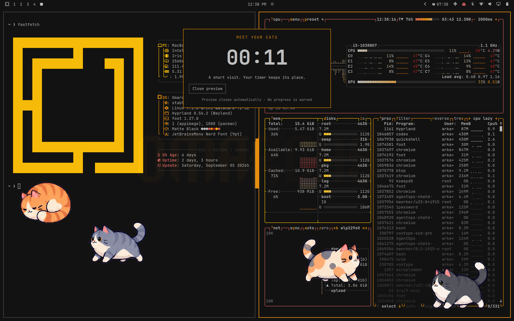

# Fat Cat Pomodoro

A small cat sanctuary for Omarchy. Focus, take a proper break, and meet a new
friend. Native Quickshell plugin; no separate application, account, or network
connection required at runtime.



## Features

- Focus, short breaks, and a long break every four focus sessions by default.
- Saved sessions survive shell restarts, including paused timers and progress.
- Safe 15-second previews leave the active timer and progress untouched.
- Four personalities and six activities: walk, stretch, groom, yawn, loaf, sleep.
- Earn cats by completing breaks: Mochi immediately, Miso after 1, Patches after
  3, Pepper after 6. Skipping and previews never earn progress. No streak penalties.
- Name cats, choose favorites, select a monitor, and enable reduced motion.
- Omarchy theme colors/fonts and keyboard-accessible settings/collection.
- Blocking breaks or a gentle overlay that lets you interact with the desktop.

## Install

```sh
omarchy plugin add https://github.com/jeremielumandong/omarchy-fat-cat.git --enable
```

Requires Omarchy's Quattro shell with the native plugin API and Quickshell 0.3.1
or compatible newer runtime. Linux/Wayland only. Uses QtQuick, Quickshell.Io,
Quickshell.Wayland, and the installed Omarchy Ui/Commons modules. `mkdir` from
coreutils is the only subprocess, used to create the private state directory.
No additional dependency downloads, root privileges, build steps, or install hooks
are needed.

For a local checkout:

```sh
bash scripts/install-local.sh
```

## Use

Click **Pomodoro** in the bar. The **Timer** tab offers Start, Pause/Resume, Stop,
Preview, intervals, monitor selection, blocking mode, and reduced motion.
Open **Cats** for your collection. Name changes save when leaving the field.
Right-clicking the bar widget also previews the sanctuary.

Defaults are 25 minutes focus, 5 minutes short break, 15 minutes long break,
and one long break after every 4 completed focus sessions. Minutes accept 1–180;
long-break frequency accepts 2–12. Saved interval changes apply to the next
interval, not the one currently running. Pause freezes the remaining duration.

A completed break starts the next focus session. **Skip break** or Escape ends a
break early with no collection reward. **Pause timer** hides the overlay; resume
from the bar. Blocking mode captures normal desktop input, but remains escapable
and does not intercept compositor shortcuts. It is not a security lock.

Preview automatically closes after 15 seconds, shows all cats, and earns no
progress. Your timer continues normally in the background. A real break taking
place ends a focus-time preview. In gentle/preview mode, clicks outside the timer
card pass through; Escape works when the card has keyboard focus.

The chosen monitor falls back to the first connected display if unplugged.
Reduced motion shows stationary loaf poses with animation timers stopped.

## Data and privacy

Settings, names and favorites are stored inline in your `arkane.fat-cat` entry
in `~/.config/omarchy/shell.json`. Timer state and completed-session counts are
saved atomically under `${XDG_STATE_HOME:-~/.local/state}/omarchy/fat-cat-session.json`.
Writes happen on changes, not on every countdown tick. Runtime does not use
network access, tracking, audio, a camera, or standing detection.

Deadlines use the wall clock and include suspend time. After waking/restarting,
an overdue focus session starts a full break; an overdue break completes once
and starts a full focus session. Missed cycles are never replayed. Manual clock
adjustments can affect the remaining interval; backward adjustments are capped
at one full interval. Missing/corrupt state resets safely to idle. The settings
panel displays a warning if saving fails.

## Update, disable, remove

Git-managed installs update with `omarchy plugin update arkane.fat-cat`.
Local installs update by rerunning `bash scripts/install-local.sh`.
If QML hot reload retains old code, run `omarchy restart shell`; v2 restores its
saved session. Upgrading from v1 resets the old in-memory timer once.

```sh
omarchy plugin disable arkane.fat-cat
omarchy plugin enable arkane.fat-cat
omarchy plugin remove arkane.fat-cat
```

Removing the plugin leaves the small session-state file for future reinstall.
To reset collection progress too, remove that file explicitly while disabled.
No other desktop settings or packaged Omarchy files are modified.

## IPC

```sh
omarchy-shell fat-cat start
omarchy-shell fat-cat pause
omarchy-shell fat-cat resume
omarchy-shell fat-cat stop
omarchy-shell fat-cat preview
omarchy-shell fat-cat dismiss
omarchy-shell fat-cat configure 25 5
omarchy-shell fat-cat status
```

Status returns JSON including the live version, phase, readiness, remaining time,
preview state, completed breaks and persistence errors.

## Development and release

```sh
bash scripts/check.sh
```

Node 22+ is used only for tests. See [RELEASE.md](RELEASE.md) for the official
Omarchy validation, runtime smoke tests, and marketplace submission steps.
The CI model tests do not substitute for testing the real Wayland shell.

Code and included generated sprites: MIT. See [assets/GENERATION.md](assets/GENERATION.md)
for asset provenance and prompts. The plugin has no dependency on the earlier
photographic prototype.
